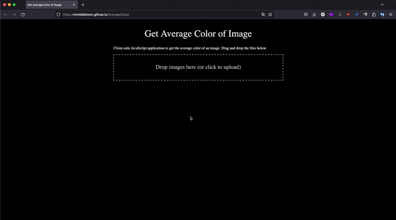

# AverageColor

## Demo

## Website

https://mmiddletonn.github.io/AverageColor

## How It Works

This website is a JavaScript application that processes images to determine their average color. Upon uploading an image, the program creates a canvas element, renders the image, and computes the average color in RGB, HEX, and HSL formats. This tool is useful for designers and developers who need to quickly assess the dominant color of an image for design or analysis purposes.

## Usage

- Drag and drop an image or click on the target area to upload an image file.
- The application displays the average color of the uploaded image in RGB, HEX, and HSL formats.
- Multiple images can be analyzed simultaneously.

## Features

- Drag and drop functionality for image upload.
- Displays color information in RGB, HEX, and HSL formats.
- Handles multiple images at once.
- Responsive design for use on various devices.

## License

This project is open-sourced and available under the [MIT License](LICENSE).

## Contact

For any queries or suggestions, feel free to contact me@matt-middleton.com
