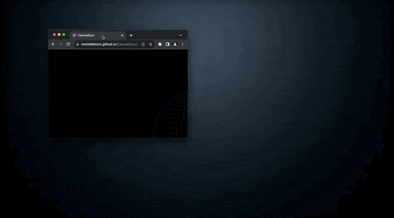

# CanvasSync

## IMPORTANT

I have only gotten this working in chrome, firefox will merely show you the animation

## Demo

## Website

https://mmiddletonn.github.io/CanvasSync/

## How It Works

The website uses JavaScript to create a canvas that dynamically adjusts its size and position based on screen and window dimensions. It continuously renders a visually dynamic orb identically across all web instances, allowing for the illusion of synchronization.

## License

This project is open-sourced and available under the [MIT License](LICENSE).

## Contact

For any queries or suggestions, feel free to contact me@matt-middleton.com.

## Credits

This project was inspired by the creative work of [_nonfigurativ_](https://twitter.com/_nonfigurativ_) on Twitter, specifically this post: https://twitter.com/_nonfigurativ_/status/1727322594570027343
